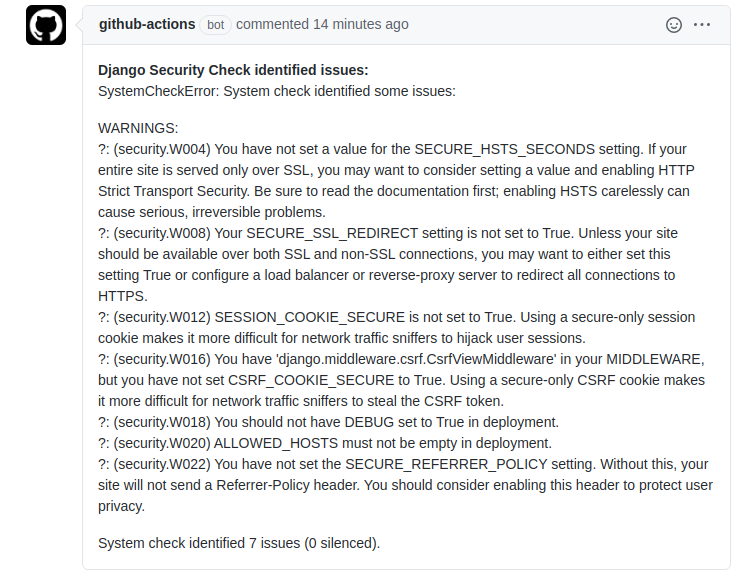

# Django Security Check

Helps you continuously monitor and fix common security vulnerabilities in your [Django](https://www.djangoproject.com/) application.

If you are thinking of using this action, congratulations. You're well on your way to building a secure Django project!

## Use this in your workflow

You can use this action in a workflow file to continuously run [Django's `check --deploy`](https://docs.djangoproject.com/en/3.0/ref/django-admin/#check) against your production Django application configuration. Here is an example workflow that runs Django Security Check on any `push` event to the `master` branch. See [below for `env` instructions](https://github.com/victoriadrake/django-security-check#setting-the-env-variables).

```yml
name: Django Security Check

on:
  push:
    branches:
      - master

env:
  SECRET_KEY: ${{ secrets.SECRET_KEY }}
  FAIL_LEVEL: WARNING
  ENV_TYPE: venv
  DEP_PATH: app/requirements.txt
  APP_PATH: app/
  EXTRA_ARGS: "--settings=app.settings.production"

jobs:
  build:

    runs-on: ubuntu-latest

    steps:
      - name: Check out master
        uses: actions/checkout@master
        with:
          fetch-depth: 1
      - name: Scan Django settings for security issues
        id: check
        uses: victoriadrake/django-security-check@master
      - name: Upload output
        uses: actions/upload-artifact@v2
        with:
          name: security-check-output
          path: output.txt
```

## View results

In the example workflow file above, you can view results in the Action workflow run, or download them as an [artifact](https://docs.github.com/en/actions/configuring-and-managing-workflows/persisting-workflow-data-using-artifacts). Here is [an example of output from a check](https://github.com/victoriadrake/react-in-django/runs/1016213333?check_suite_focus=true#step:4:45).

You can also add the check output to a comment, for example, if the workflow was triggered by a pull request. To do this, [set an output parameter](https://docs.github.com/en/actions/reference/workflow-commands-for-github-actions#setting-an-output-parameter) and use `actions/github-script`. Here's an example workflow you can copy that runs on pull requests:

```yml
name: Django Security Check

on: pull_request_target

env:
  SECRET_KEY: ${{ secrets.SECRET_KEY }}
  FAIL_LEVEL: WARNING
  ENV_TYPE: pipenv

jobs:
  build:

    runs-on: ubuntu-latest

    steps:
      - name: Check out master
        uses: actions/checkout@master
        with:
          fetch-depth: 1
      - name: Scan Django settings for security issues
        id: check
        uses: victoriadrake/django-security-check@master
      - id: results
        run: |
          OUTPUT=$(cat output.txt)
          FORMATTED=${OUTPUT//$'\n'/%0A}
          echo ::set-output name=file::**Django Security Check identified issues:** %0A$FORMATTED
      - name: Comment with output
        uses: actions/github-script@v3
        with:
          script: |
            github.issues.createComment({
              issue_number: ${{ github.event.number }},
              owner: context.repo.owner,
              repo: context.repo.repo,
              body: `${{ steps.results.outputs.file }}`
            })
```

This produces:



Helpful instructions for remediation are provided by Django in the output.

### Setting the `env` variables

There must be a `SECRET_KEY` value available in order for Django to run the checks. Otherwise, an `ImproperlyConfigured` exception is raised. If you don't deploy from your repository, you may use a dummy value. [Set a repository secret](https://docs.github.com/en/actions/reference/encrypted-secrets#creating-encrypted-secrets-for-a-repository) with the name of `SECRET_KEY` and include this as an environment variable as shown in the examples above.

The `FAIL_LEVEL` environment variable is the minimum severity finding that will cause the check to fail. Choices are `CRITICAL`, `ERROR`, `WARNING`, `INFO`, and `DEBUG`. If not set, it defaults to `ERROR`.

Depending on what you've set as a `FAIL_LEVEL`, this action may return results without a failed check. For example, the default `ERROR` level may still return `WARNING` results, although the check is a pass. To fail the check on `WARNING` results, set `FAIL_LEVEL` to `WARNING`, `INFO`, or `DEBUG`.

This action currently supports use of [Pipenv](https://pipenv.pypa.io/en/latest/) or [`venv`](https://docs.python.org/3/library/venv.html#module-venv).

If you are using Pipenv, set `ENV_TYPE: pipenv`. Set the `DEP_PATH` variable to point to the directory containing your `Pipfile`. For example, if you have `project-root/app/Pipfile`, set `DEP_PATH: app/`. If you have `project-root/Pipfile`, you can leave this unset.

If you are using `venv`, set `ENV_TYPE: venv` as above. Set the `DEP_PATH` variable to the path of your dependencies file from the root, including the file name, as above. This is usually called `requirements.txt`, but may be different in your application.

Set the `APP_PATH` to the location of your `manage.py` file. For example, if you have `project-root/application/manage.py`, then set `APP_PATH: application/`. If you have `project-root/manage.py`, you can leave this unset.

If you are not using a virtual environment, shame on you. This action will still try to help you by installing Django. Ensure you set `APP_PATH` to the directory of your `manage.py` file.

You can use `EXTRA_ARGS` to pass any additional desired arguments, such as a settings module.

### Workflow customization

See full instructions for [Configuring and managing workflows](https://help.github.com/en/actions/configuring-and-managing-workflows).

For help editing the YAML file, see [Workflow syntax for GitHub Actions](https://help.github.com/en/actions/automating-your-workflow-with-github-actions/workflow-syntax-for-github-actions).
